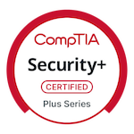

# Welcome

Hi, I’m **Rushil**, a **Cybersecurity & Cloud Professional** passionate about building **secure, scalable, and efficient systems**.  
I enjoy working at the intersection of **security, cloud and IoT**. 

---

## 📂 Featured Projects and Walkthroughs

| Project | Description | Tech Stack | Links |
|---------|-------------|------------|-------|
| 🌐 **Wazuh SIEM** | Deployed SIEM in homelab to detect security incidents in homelab | Wazuh, Docker | [GitHub Repo](https://github.com/Rushil-Labs/Wazuh) |
| 🌐 **Grafana Monitoring stack** | Open Source monitoring stack deployment | Grafana, Loki, cAdvisor, Prometheus | [GitHub Repo](https://github.com/Rushil-Labs/Monitoring-Stack) |
| 🌐 **Endless SSH Honeypot** | Exploits the banner feature of ssh to delay bruteforce attacks | Docker, SSH | [GitHub Repo](https://github.com/Rushil-Labs/ssh-honeypot) |
| 🛒 **AWS Mult Tier E-commerce app** | Cloud-native e-commerce app with authentication, product images, and persistent storage | ECS, RDS, Cloudfront, S3, ALB, Cognito | [GitHub Repo](https://github.com/Rushil-Labs/AWS-Multi-tier-app) |
| 🛡️ **CrowdSec Integration** | Leveraged **CrowdSec** to detect and mitigate malicious IP activity, enhancing server security with community-driven threat intelligence | CrowdSec, Linux, Firewall | [GitHub Repo](https://github.com/Rushil-Labs/Crowdsec) |
| 🌐 **Cloudflare DDNS Updater** | Lightweight Bash script to sync home lab domain with private IP to facilitate internal DNS lookups | Bash, Cloudflare API | [GitHub Repo](https://github.com/Rushil-Labs/cloudflare_ddns_updater) |

## 📜 Certifications

